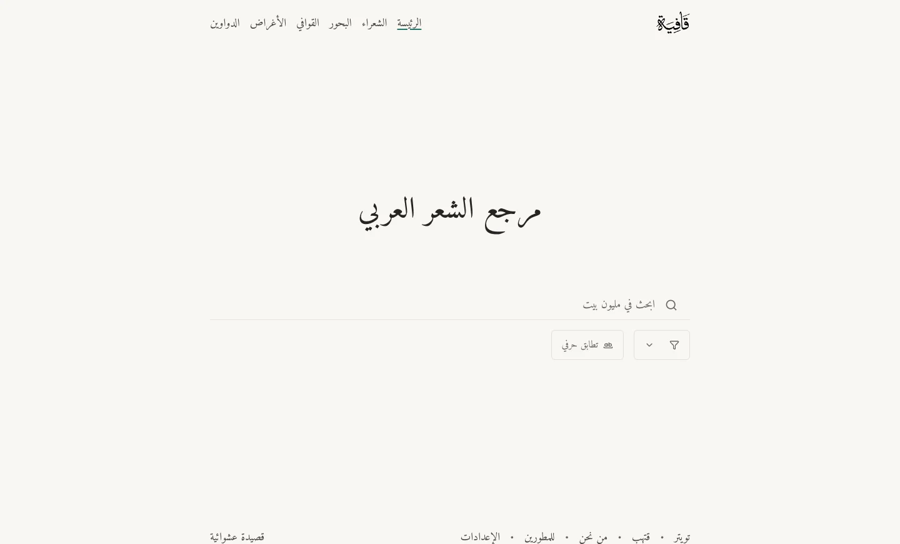
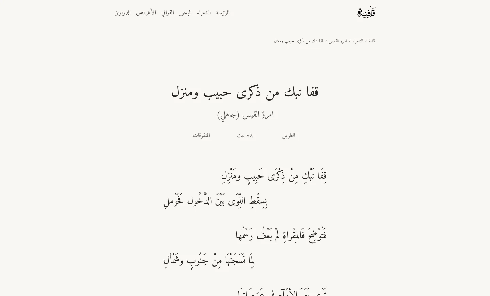
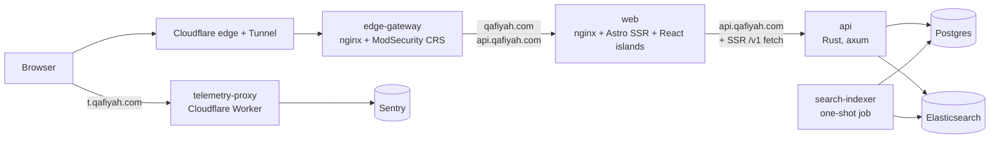

<picture>
  <source media="(prefers-color-scheme: dark)" srcset=".github/readme_banner_darkmode.webp">
  <source media="(prefers-color-scheme: light)" srcset=".github/readme_banner_lightmode.webp">
  
</picture>

<p align="center">
  <picture>
    <source media="(prefers-color-scheme: dark)" srcset=".github/readme_tagline_darkmode.svg">
    <source media="(prefers-color-scheme: light)" srcset=".github/readme_tagline_lightmode.svg">
    
  </picture>
</p>

<p align="center">
  <a href="https://qafiyah.com"></a>
  <a href="https://api.qafiyah.com/v1/docs"></a>
  <a href="data/db"></a>
  <a href="LICENSE"></a>
  <a href="data/LICENSE"></a>
</p>

Qafiyah is an open-source reference for Arabic poetry. Search every verse for any word or phrase, or browse by poet, meter, rhyme, era, and theme, at [qafiyah.com](https://qafiyah.com). The code, the data, and a free JSON API are all public, and [contributions are welcome](#contributing).

|   Poems |    Verses |  Poets | Meters | Rhymes | Eras | Themes | Collections |
| ------: | --------: | -----: | -----: | -----: | ---: | -----: | ----------: |
| 374,176 | 6,287,322 | 17,338 |     44 |     36 |   12 |     10 |           1 |

<sub>From snapshot <code>0031_23_09_2026</code>. Poets, eras, and meters each count one "unknown" entry for unattributed records.</sub>

<p align="center">
  
  
</p>

## Try it

**Read.** Browse [qafiyah.com](https://qafiyah.com), or follow [@qafiyahx](https://x.com/qafiyahx) on X for a poem a day.

**Ask the API.** No key, no sign-up:

```bash
curl "https://api.qafiyah.com/v1/poems/random?option=lines"
```

**Run it locally.** You need [Bun](https://bun.sh) 1.3.14, a Docker engine ([OrbStack](https://orbstack.dev) or Docker Desktop), and [rustup](https://rustup.rs):

```bash
git clone https://github.com/raaqimorg/qafiyah.git
cd qafiyah
bun install
bun run dev
```

The first run starts Postgres and Elasticsearch in Docker, restores a 100-poem sample, builds the search index, and serves the site at http://localhost:4321 and the API at http://localhost:8787, with no `.env` or secrets. Everyday commands and troubleshooting are in [`docs/development.md`](docs/development.md).

## API

`https://api.qafiyah.com/v1` serves read-only JSON for poems, poets, eras, meters, rhymes, themes, collections, and full-text search. Explore the [interactive docs](https://api.qafiyah.com/v1/docs), the [OpenAPI document](https://api.qafiyah.com/v1/openapi.json), or [llms.txt](https://api.qafiyah.com/llms.txt).

| Access   | Limit                                              |
| -------- | -------------------------------------------------- |
| No key   | 60 requests per hour per address                   |
| Free key | 500 requests per hour, burst of 10 per second      |
| Higher   | write to [api@qafiyah.com](mailto:api@qafiyah.com) |

Sign in with Google or GitHub on the [developers page](https://qafiyah.com/developers) to create a key, and send it as the `x-api-key` header. Responses report `x-ratelimit-remaining`, a refused request returns 429 with `Retry-After`, and errors are RFC 9457 problem+json.

## Data

Postgres is the source of truth, Elasticsearch is a search index rebuilt from it, and poet avatars are served from Cloudflare R2 at `cdn.qafiyah.com`. Snapshots are versioned in this repo: database dumps in [`data/db/`](data/db/README.md) and avatar archives in [`data/avatars/`](data/avatars/README.md).

The 100-poem sample that `bun run dev` restores is plain text. The full snapshots are encrypted but free for anyone: email [dumps@qafiyah.com](mailto:dumps@qafiyah.com) or [avatars@qafiyah.com](mailto:avatars@qafiyah.com) with what you plan to build, and a passphrase comes right back, with no vetting. Encryption only keeps a record withdrawable later, since a plaintext file pushed to a public repo stays in every clone. Details are in [`data/README.md`](data/README.md).

## How it works

A request enters through Cloudflare, passes the web application firewall, and reaches the web app or the API. The web app renders pages on the server by calling the API, which reads Postgres for records and Elasticsearch for search.



| Part                                                     | Role                                                                                | Built with                               |
| -------------------------------------------------------- | ----------------------------------------------------------------------------------- | ---------------------------------------- |
| [`apps/web`](apps/web/AGENTS.md)                         | Server-rendered pages, with React islands for search, the random poem, and settings | Astro, React, Tailwind CSS, Bun, PostHog |
| [`apps/api`](apps/api/AGENTS.md)                         | Read-only `/v1` API, its OpenAPI contract generated from the code                   | Rust, axum, sqlx, utoipa, PostgreSQL 18  |
| [`apps/search-indexer`](apps/search-indexer/AGENTS.md)   | One-shot job that builds a fresh index from Postgres and swaps the alias            | Rust, Elasticsearch 9                    |
| [`crates/elasticsearch`](crates/elasticsearch/AGENTS.md) | Index schema, Arabic analyzers, and client shared by the two above                  | Rust                                     |
| [`apps/edge-gateway`](apps/edge-gateway/AGENTS.md)       | Web application firewall in front of everything, configuration only                 | nginx, OWASP ModSecurity CRS             |
| [`apps/telemetry-proxy`](apps/telemetry-proxy/AGENTS.md) | Forwards browser error reports to Sentry from a first-party hostname                | Cloudflare Workers                       |
| [`apps/inspector`](apps/inspector/AGENTS.md)             | Dev-only report of the metadata on every page type                                  | TypeScript                               |
| [`scripts/`](scripts/AGENTS.md)                          | Repo tooling and the CI gate, one `bun run` name per entry point                    | Bun, Turborepo, oxlint, oxfmt, vitest    |

Search reads Arabic the way people do: hamza forms, alif maqsura, and ta marbuta fold to their base letters, diacritics are ignored for matching and kept for display, and an exact title always outranks scattered matches. The full account is in [`docs/search.md`](docs/search.md).

Production is one VPS running six containers behind a Cloudflare Tunnel, with nothing reachable inbound, and deploys are a manual step. [`docs/topology.md`](docs/topology.md) maps the whole system and [`docs/deployment/`](docs/deployment/README.md) covers operations.

## Contributing

Report bugs and ideas in [GitHub issues](https://github.com/raaqimorg/qafiyah/issues). To change code, fork the repo, branch off `main`, run `bun run ci`, and open a pull request; [`CONTRIBUTING.md`](.github/CONTRIBUTING.md) walks through it. Good places to start are the web app, search relevance, and the repo tooling. Every component has an `AGENTS.md` describing its shape, and [`docs/exceptions.md`](docs/exceptions.md) lists where the code departs from the usual approach, and why.

<details>
<summary><b>What <code>bun run ci</code> checks</b></summary>
<br>

[`scripts/ci.ts`](scripts/ci.ts) runs lint and format, type and repo checks, unit tests, and contract snapshots (OpenAPI, the generated client, Elasticsearch queries), then, with Docker, database-backed tests and smoke tests against the built stack. The pre-commit hook runs it without Docker, the pre-push hook runs the Docker phase, and GitHub Actions runs `bun run ci --no-docker` plus gitleaks on every push and pull request. Clippy denies `unwrap`, `expect`, `panic`, indexing, and lossy casts in production code. More in [`docs/testing.md`](docs/testing.md).

</details>

<details>
<summary><b>Documentation map</b></summary>
<br>

- [`docs/development.md`](docs/development.md): running the stack locally, everyday commands, worktrees, committing.
- [`docs/topology.md`](docs/topology.md): a diagram-first map of the whole system, code and production.
- [`docs/deployment/README.md`](docs/deployment/README.md): the production entry point.
- [`docs/domain.md`](docs/domain.md): what a poem, poet, meter, rhyme, era, theme, and collection mean.
- [`docs/search.md`](docs/search.md): Arabic text handling, relevance tiers, snippet selection.
- [`docs/code-conventions.md`](docs/code-conventions.md) and the TypeScript, Rust, testing, and pull-request files next to it: how code, tests, and commits are written.
- [`docs/identity.md`](docs/identity.md): canonical name, description, organization, and links.
- [`AGENTS.md`](AGENTS.md) and each component's `AGENTS.md`: repo layout and component shapes, written for AI agents and useful to anyone.
- [`data/README.md`](data/README.md): the encrypted database and avatar snapshots.

</details>

## Contact

Qafiyah is maintained by [Raaqim](https://raaqim.org), an open-source organization behind several Arabic-language projects, together with its contributors. The site's [about page](https://qafiyah.com/about) tells the story. To reach us, chat on [Telegram](https://t.me/qafiyahx), or write to the address that fits below; API and data requests have their own addresses in the sections above.

| For                                                              | Write to             |
| ---------------------------------------------------------------- | -------------------- |
| General contact                                                  | mail@qafiyah.com     |
| Problems with the site or the data                               | issues@qafiyah.com   |
| Security reports, kept private ([policy](.github/SECURITY.md))   | security@qafiyah.com |
| Conduct concerns ([code of conduct](.github/CODE_OF_CONDUCT.md)) | conduct@qafiyah.com  |

## License

The code and documentation are released under the [MIT license](LICENSE). The data, meaning the poem catalog the site and API serve and the snapshots in `data/`, is dedicated to the public domain under [CC0 1.0](data/LICENSE). The site's typeface, [Amiri](https://github.com/aliftype/amiri), is used under the SIL Open Font License 1.1, the code of conduct is adapted from the [Contributor Covenant](https://www.contributor-covenant.org) 2.1, and the edge gateway runs the stock `owasp/modsecurity-crs` nginx image.

<br>

<p align="center" dir="rtl">الشِّعرُ ديوانُ العرب<br><sub>ابن عباس</sub></p>
