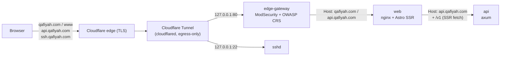
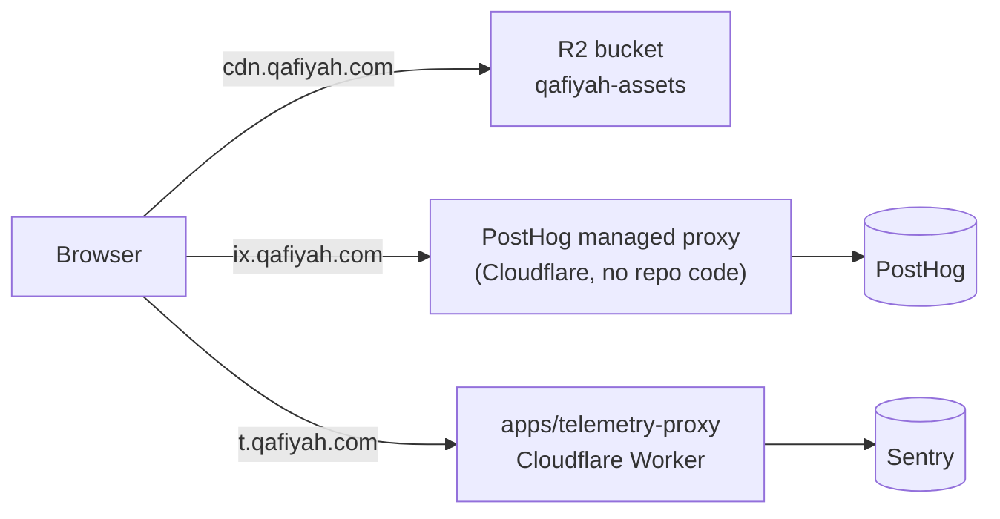
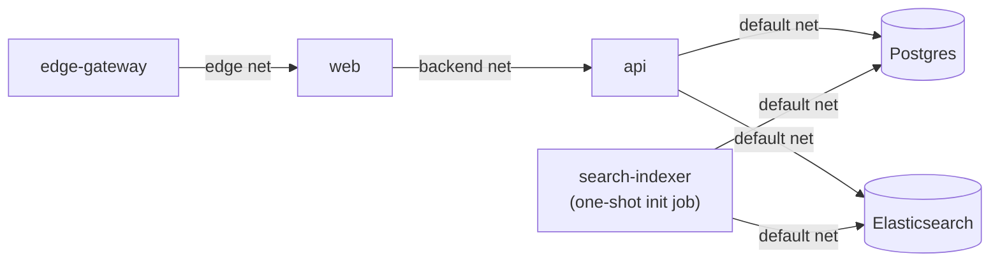
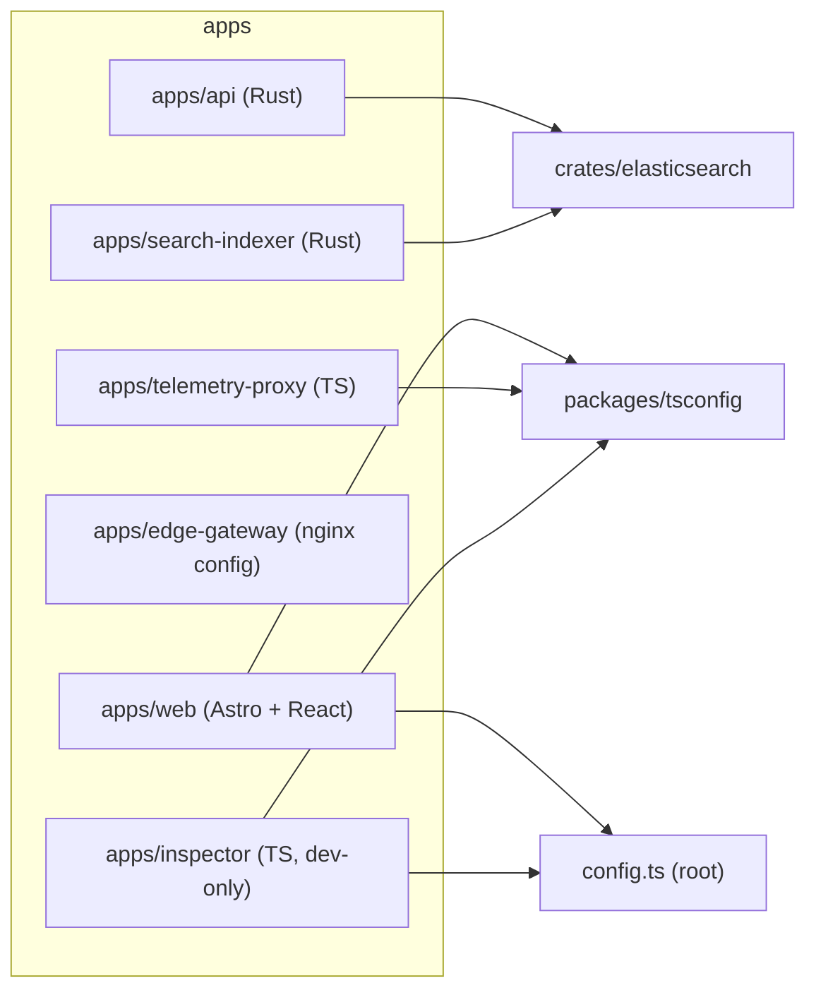

# Topology

A single-page, diagram-first map of the whole system: what talks to what, in code and in
production. Each section links to the doc that carries the actual depth, this page's only job is
the big picture.

> Same rule as `docs/deployment/README.md`: this file stays secret-free. No credentials, tokens, real IPs, or
> Cloudflare account/tunnel IDs.

## Traffic into the VPS

Nothing is reachable inbound, SSH included, everything arrives over the tunnel and every listener
binds to loopback. Full mechanics, the zero-downtime rolling deploy, and the security posture:
`docs/deployment/architecture.md`.

## Traffic that bypasses the VPS entirely

Three Cloudflare-only paths, none of them touch the WAF or the docker compose stack:

- `cdn.qafiyah.com` serves poet avatar images straight from R2 (`poets/<slug>/avatar.webp`). See
  `data/avatars/README.md`.
- `ix.qafiyah.com` is PostHog's own managed reverse proxy, provisioned on the Cloudflare side,
  there's no code for it in this repo.
- `t.qafiyah.com` is `apps/telemetry-proxy`, a first-party Worker that forwards browser error and session telemetry to Sentry. Details: `apps/telemetry-proxy/AGENTS.md`.

## Inside the VPS

Six containers, one `docker compose` stack, prod and dev coexist on the same VPS under separate
project namespaces. They are segmented into three networks so each hop trusts only its immediate
upstream: `edge` carries `edge-gateway` and `web` only, `backend` carries `web` and `api` only, and
`default` carries `api`, `db`, `es`, and the indexer. Ports, healthchecks, and per-service details:
`docs/deployment/services.md` and `docs/deployment/architecture.md`.

## Data topology

Three independent stores, different roles:

- **Postgres**: source of truth for poems, poets, and every taxonomy table.
- **Elasticsearch**: derived search index, fully rebuilt from Postgres by `search-indexer`.
  Nothing backs it up directly, `bun run reindex`/`reindex:prod` regenerates it from Postgres on
  demand.
- **R2**: object storage for poet avatar images, independent of Postgres (referenced by
  `poet.has_avatar`, not stored in it).

`data/` mirrors the two stores that can't be trivially regenerated:

- `data/db/`: versioned, encrypted Postgres dump snapshots. Automated (`bun run db:*`,
  self-seeding). See `data/db/README.md` and `data/db/MAINTAINERS_GUIDE.md`.
- `data/avatars/`: versioned, encrypted avatar-zip snapshots, same directory-naming and
  encryption pattern as `data/db/`, but manual today, no dedicated scripts yet. See
  `data/avatars/README.md`.

## Codebase topology

Turborepo orchestrates the TypeScript workspace (`apps/*` + `packages/*`); a separate Cargo
workspace covers the Rust side (`apps/api`, `apps/search-indexer`, `crates/elasticsearch`).
`apps/edge-gateway` is config only (no build step, an nginx image plus a template override).
Conventions: `docs/code-conventions.md`, `docs/typescript-conventions.md`,
`docs/rust-conventions.md`. Each component's `AGENTS.md` is listed in `README.md` ("Documentation map").

## CI/CD topology

- **Every push and PR to `main`** (`.github/workflows/ci.yml`): the gate without its Docker phases, `bun run ci --no-docker` (static checks, types and repo checks, TypeScript and Rust tests, clippy, and the contract snapshots). The Docker phases (database-backed tests and the dev and stack smoke) run only locally, through the pre-push hook. `.github/workflows/gitleaks.yml` scans every push and PR for committed secrets.
- **Docker images are built on demand** (`.github/workflows/images.yml`, `workflow_dispatch`): one matrix job per service, build-only, nothing is pushed to a registry. Locally, `bun run build:images` builds the same images on their own; `bun run ci` builds them as part of the stack smoke.
- **Merging to `main` does not deploy.** Production deploy is a separate, manual, ordered step (`bun run deploy`, runbook in `.claude/skills/deploy/SKILL.md`): it SSHes to the VPS, rebuilds images from source there, and rolls `api`/`web` with zero downtime. See `docs/deployment/README.md`.

## External services

| Service    | Role                                                     | Reached via                              |
| ---------- | -------------------------------------------------------- | ---------------------------------------- |
| Cloudflare | DNS, TLS, Tunnel (ingress), R2 (object storage), Workers | all subdomains, `cdn.`, `t.`             |
| Sentry     | Error/session tracking for api + web                     | `t.qafiyah.com` (`apps/telemetry-proxy`) |
| PostHog    | Product analytics                                        | `ix.qafiyah.com` (Cloudflare-managed)    |
| GitHub     | Source hosting, Actions CI, secret scanning              | `.github/workflows/`                     |

## See also

- `README.md`: component overview and quick start
- `AGENTS.md`: repo layout and conventions index
- `docs/deployment/README.md`: deploy/ops entry point (splits into the `docs/deployment/*` files linked above)
- `data/README.md`: the two `data/` subsystems
